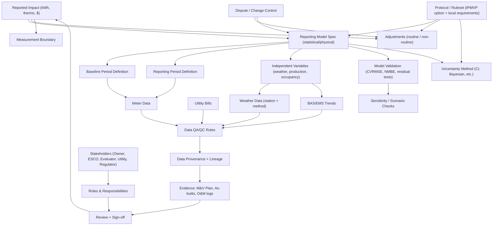

# MnV_context_graph

Test of concept

## How to read this graph

- Boxes represent entities that contribute to the meaning of reported impact.
- Arrows represent dependency or constraint relationships.
- Changing a node or relationship implies a change in interpretation, not just a recalculation.
- Governance nodes indicate where agreement, review, or dispute resolution applies.
