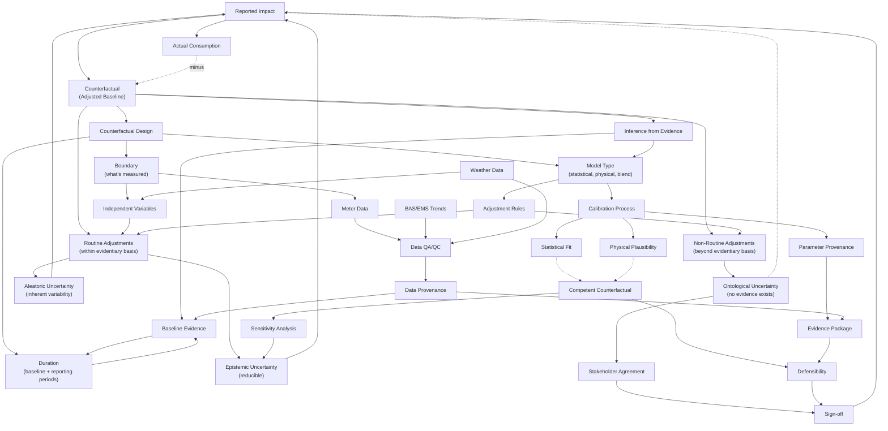

# M&V Context Graph: Counterfactual Design

## Counterfactual Design

A counterfactual is not discovered — it is **designed**. The design choices determine what claims can be made and how defensible they are.

### Primary Dimensions

| Dimension | Question |
|-----------|----------|
| **Boundary** | What is inside/outside the measurement fence? |
| **Duration** | How long is the baseline? The reporting period? |
| **Model Type** | Statistical, physical simulation, or blend? |

These are the fundamental choices. Everything else is constrained by them.

### Secondary Dimensions

- **Independent variables**: What factors explain consumption variation?
- **Adjustment rules**: How are baseline conditions projected into reporting conditions?

These flow from the primary dimensions — boundary determines what data you need, duration determines your evidentiary basis, model type determines how projection works.

## Inference and Its Limits

The counterfactual is built through **inference from evidence**:
- Baseline evidence: observed conditions and consumption
- Model: systematic rules for projection

This works for **routine adjustments** — conditions that vary within the range of baseline evidence (weather, occupancy, production).

## Ontological Uncertainty

When something occurs in the reporting period that has **no analog in the baseline evidence**, inference from evidence ends.

This is **ontological uncertainty** — not reducible through better analysis, not quantifiable through statistics. The counterfactual under these conditions *does not exist* as a discoverable fact.

Non-routine adjustments live here. They require **stakeholder agreement**, not just technical analysis.

## Three Types of Uncertainty

| Type | Character | Lives in |
|------|-----------|----------|
| **Epistemic** | Reducible with more data/analysis | Model fit, data quality |
| **Aleatoric** | Inherent variability, quantifiable | Weather, occupancy variation |
| **Ontological** | No evidence exists | Non-routine adjustments |

## Competent Counterfactual

A counterfactual is competent when:
1. Design choices are explicit and justified
2. Inference from evidence is sound
3. Ontological uncertainty is acknowledged
4. Stakeholders agree on judgment calls
5. The whole chain is documented

## Reading the Graph

- **Solid arrows** (→): Data flow or constraint
- **Dashed arrows** (⇢): Judgment or uncertainty propagation
- Primary dimensions sit at the top — they shape everything downstream
- Ontological uncertainty connects to stakeholders, not just to impact
