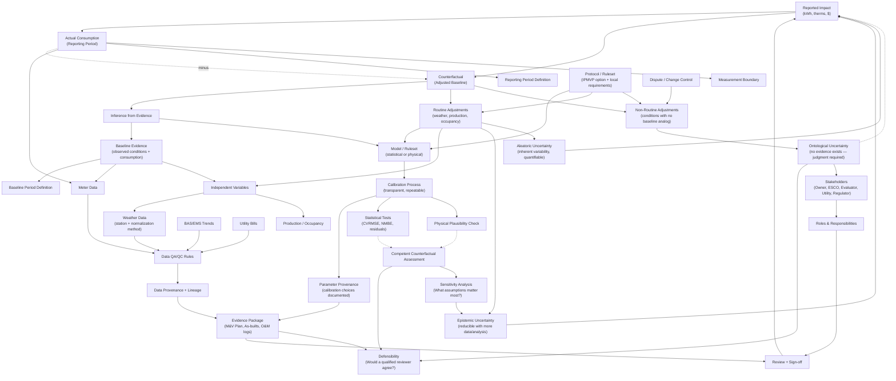

# M&V Context Graph: Competent Counterfactual Framework

## Key Concepts

### The Fundamental Equation
**Impact = Actual − Counterfactual**

The counterfactual (adjusted baseline) is *constructed through inference*, not measured.

### Inference from Evidence
The counterfactual is built from:
- **Baseline evidence**: Observed conditions and consumption during a defined period
- **Model/ruleset**: Systematic method for projecting that evidence into reporting period conditions

This is legitimate inference — we have evidence, we apply rules.

### Three Types of Uncertainty

| Type | Source | Character |
|------|--------|-----------|
| **Epistemic** | Incomplete analysis of available evidence | Reducible with effort |
| **Aleatoric** | Inherent system variability | Quantifiable, not reducible |
| **Ontological** | Conditions in reporting period have no baseline analog | No evidence exists — requires judgment |

### Where Ontological Uncertainty Lives
**Non-routine adjustments** are the boundary where inference from evidence ends.

When something occurs in the reporting period that was *not part of the baseline evidence* — new equipment, changed use, different occupancy patterns, a pandemic — we have no evidentiary basis for the counterfactual under those conditions.

This is not "harder to estimate." It is a fundamentally different epistemic status: we are making claims about a world-state for which *no direct evidence exists*.

### Why This Matters
- **Routine adjustments**: Governed by models and rules. Defensible through statistical tests and physical plausibility.
- **Non-routine adjustments**: Governed by *stakeholder agreement*. Defensibility requires transparency about the judgment being made.

This is where M&V disputes actually live — not in the statistics, but in the non-routines.

### Competent Counterfactual
A counterfactual is "competent" when:
1. Inference from evidence is sound (statistical + physical plausibility)
2. Ontological uncertainty is acknowledged and bounded
3. Stakeholders agree on the judgment calls
4. The whole chain is documented and defensible

## How to Read This Graph

- **Solid arrows** (→): Data flow or direct dependency
- **Dashed arrows** (⇢): Judgment, inference, or propagation of uncertainty
- **Ontological uncertainty** connects directly to stakeholders — because that's where agreement must be reached
