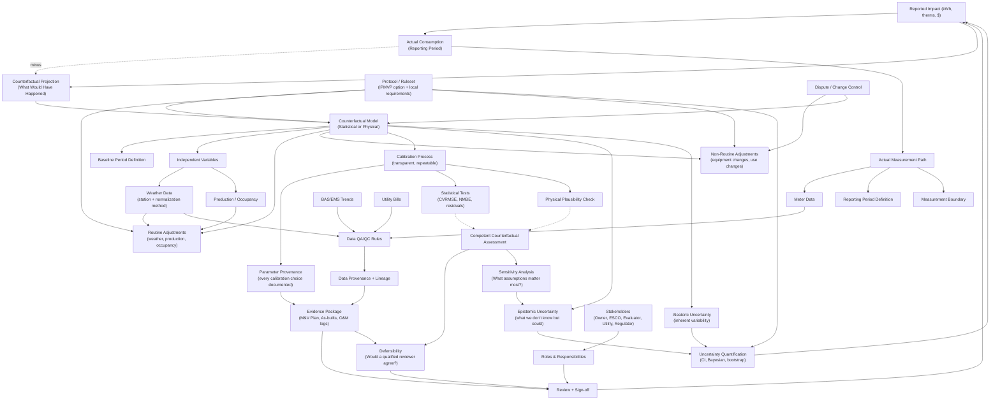

# M&V Context Graph: Competent Counterfactual Framework

## Key Concepts in This Graph

### The Fundamental Equation
**Impact = Actual − Counterfactual**

This makes explicit what traditional M&V often obscures: we're not just comparing two measurements. We're comparing what *happened* against what *would have happened* — a fundamentally different epistemic claim.

### Dual Digital Twin
The graph shows two parallel paths:
- **Actual Measurement Path**: What the meters recorded during the reporting period
- **Counterfactual Model**: Our best estimate of consumption *absent the intervention*

### Competent Counterfactual (The Judgment Layer)
Statistical tests (CVRMSE, NMBE) are *necessary but not sufficient*. A competent counterfactual also requires:
- **Physical plausibility**: Does the model behave like a real building?
- **Defensibility**: Would a qualified, skeptical reviewer find this credible?
- **Sensitivity analysis**: Which assumptions drive the result?

Passing thresholds is checkbox compliance. Building confidence is the real goal.

### Two Types of Uncertainty
- **Epistemic**: Uncertainty from incomplete knowledge (reducible with more data/analysis)
- **Aleatoric**: Inherent randomness in the system (irreducible)

Conflating these leads to false confidence or unnecessary conservatism.

### Parameter Provenance
Every calibration choice should be documented: what was changed, why, what alternatives were considered. This isn't just audit trail — it's how we build (and communicate) confidence.

### Governance as First-Class Concern
M&V results are social agreements as much as technical calculations. The graph acknowledges that stakeholder alignment, dispute resolution, and sign-off are integral to the meaning of "reported impact."

## How to Read This Graph

- **Solid arrows** (→): Direct dependency or data flow
- **Dashed arrows** (⇢): Inferential or judgment relationship
- Nodes are color-grouped conceptually (rendering depends on viewer)
- The "Competence" node is the bridge between technical validity and stakeholder acceptance
